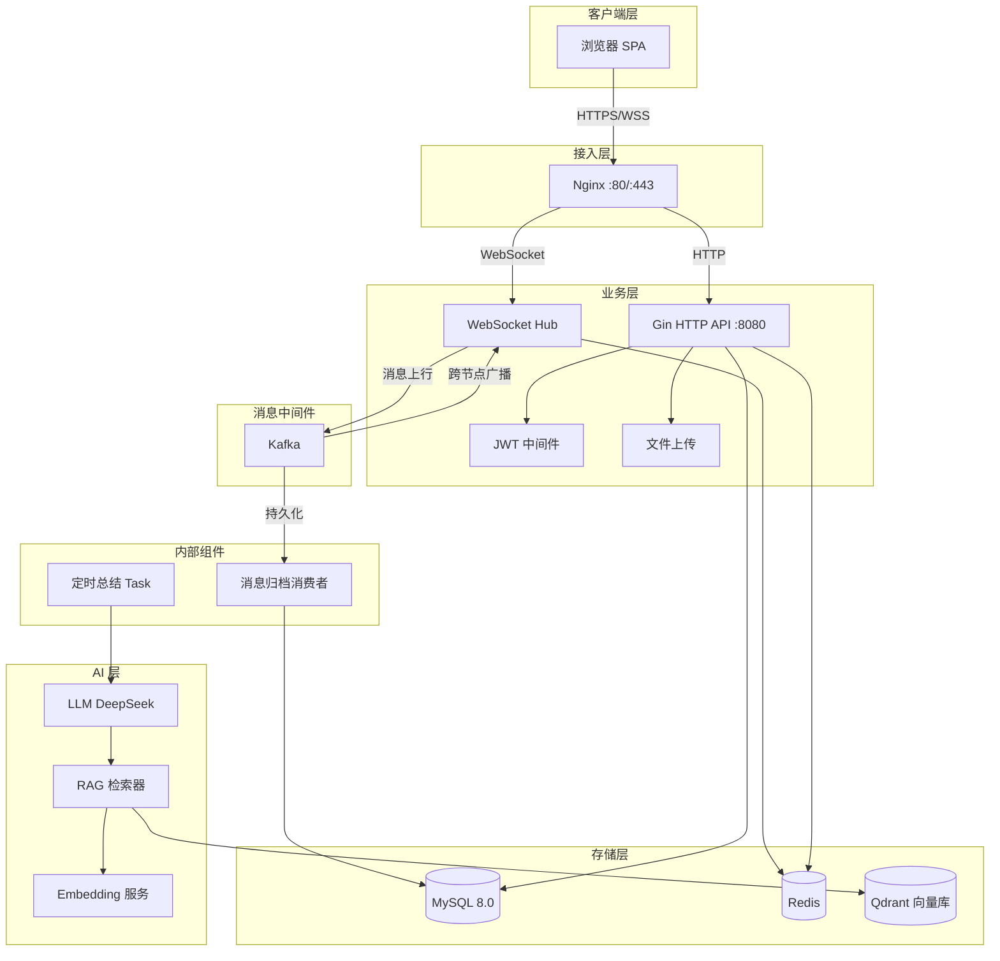

# 架构设计文档

## 系统概述

Lan IM 是一个高性能单机 WebSocket 即时通讯网关，支持 C100K 级并发长连接，集成 LLM/RAG Agent 实现群聊智能助手。

## 系统架构图



## 核心模块

### WebSocket Hub（`core/`）

无锁协程模型：每个客户端连接生成独立的 Goroutine，通过 Channel 进行事件分发：

- **Subscribe**: 客户端上线，注入 Hub 路由表
- **Unsubscribe**: 客户端断开，清理所有房间引用
- **ForwardMessage**: 跨节点广播（Redis Pub/Sub）或本地转发
- **RoomAction**: 动态加入/离开/解散群聊
- **Kick**: 强制踢出用户

关键特性：
- 分片锁（512 个 Mutex）降低数据竞争
- `sync.Map` 管理在线用户和会话映射
- Send channel 关闭前先摘除引用，杜绝 `send on closed channel` panic

### 消息链路

```
客户端 → WebSocket → Kafka Producer → Kafka → 消息归档消费者 → MySQL
                    ↓
              Redis Pub/Sub → 本节点 Hub → 目标客户端 WebSocket
```

### JWT 鉴权（`middleware/`）

- Bearer Token 标准头或 URL Query 参数（兼容 WebSocket 握手）
- HMAC-SHA256 签名，24 小时过期
- 角色隔离：普通用户(0) / 超级管理员(1)

### LLM Agent（`agent/`）

群聊 AI 助手，支持三种触发模式：

| 模式 | 说明 |
|------|------|
| @ 提及 | 消息中包含 @agent 或 @ 提及时触发 |
| 全部消息 | 对每条消息都做出响应 |
| 关键词 | 匹配预设关键词时触发 |

Agent 架构：

```
消息到达 → 触发器判断 → RAG 检索（Qdrant）→ 构建 Prompt → LLM 调用 → 回复消息
```

## 部署架构

```
docker compose up -d

┌──────────────────────────────────────┐
│  nginx      :80, :443               │
│  backend    :8080 (API), :6060 (pprof)│
│  mysql      :3306                    │
│  redis      :6379                    │
│  kafka      :9092 (KRaft 模式)       │
│  qdrant     :6333                    │
└──────────────────────────────────────┘
```

## 性能基线

| 场景 | 并发连接 | 消息吞吐 | 平均延迟 |
|------|----------|----------|----------|
| 500 人群聊 | 500 | 11.2 万条/秒 | 5.92ms |
| 万人在线 | 10,000 | — | WS 建连 2.45ms |
| 千人活跃加密 | 10,000 | 2.5 万条/秒 | HTTP P95 9.48ms |

测试工具：K6，配置见 `bench_ws.js`