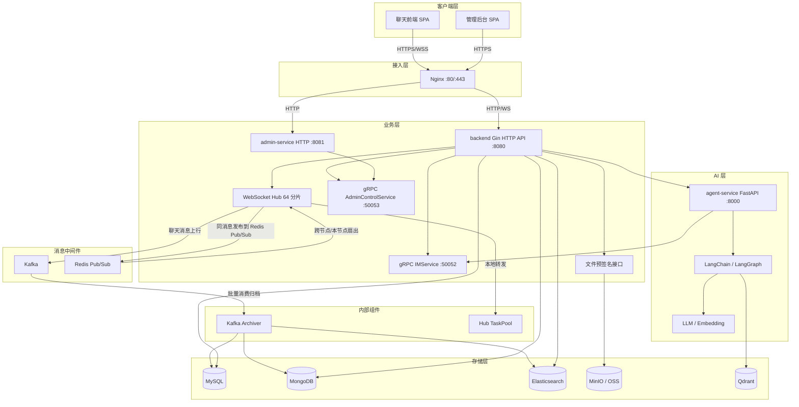

# 架构设计文档

## 系统概述

Lan IM 是面向局域网与云服务器部署的即时通讯系统。前端通过 WebSocket 接入，后端负责会话路由、鉴权、对象存储预签名和管理控制；消息经 Kafka 与 Redis Pub/Sub 完成解耦、持久化和跨节点扇出；Python Agent 服务基于 LangChain + LangGraph 提供群聊智能助手能力。

## 系统架构图



## 核心模块

### WebSocket Hub（`services/gateway/websocket`）

Hub 按用户和房间两个维度分片，默认 `64` 个分片，可通过 `HUB_SHARD_COUNT` 调整。每个分片使用 `sync.RWMutex + map` 维护用户和房间映射，并通过分片级 Channel 串行处理转发和踢人事件，避免单把全局锁成为扇出瓶颈。

- **Register**：将连接写入用户分片，并订阅初始房间集合。
- **Unregister**：先从用户分片和所有房间分片移除，再关闭 Send Channel，避免 `send on closed channel`。
- **UpdateRooms / JoinRoom / LeaveRoom**：动态维护房间订阅关系。
- **Publish**：将消息投递到房间对应分片的 `forward` Channel。
- **Kick / CloseConnection**：按用户或连接 ID 强制断开连接。

房间成员数小于 `100` 时，分片内同步遍历投递；达到或超过 `100` 时，改用 `shared/concurrency/taskpool`（ANTS）异步扇出，防止单房间大群阻塞分片循环。慢客户端写入队列满时会被记录并主动摘除。

### 消息链路

```text
浏览器 WebSocket（JSON）
  → backend ReadPump 解析并校验 ClientMsgID
  → Kafka Producer 写入 im_chat_messages（protobuf）
  → Kafka Archiver 批量消费（1000 条/500ms）
      → MySQL/MongoDB 历史消息
      → Elasticsearch 索引
      → Redis 最新消息缓存
  → Redis Pub/Sub 同时发布 im:broadcast:room:{room_id}
  → 各节点 StartGlobalListener 解包 protobuf
  → 本节点 Hub.Publish
  → 目标房间 WebSocket 客户端
```

说明：

- 浏览器到 backend 的 WebSocket 载荷保持 JSON，便于前端直接处理。
- Kafka 消息 Value 和 Redis `im:broadcast:*` 载荷使用 protobuf，降低内部通信开销。
- Kafka 按 `room_id` 哈希分区，保证同群消息顺序。
- `ClientMsgID` 用于客户端幂等和防重。

### JWT 鉴权（`shared/http/middleware`）

- Bearer Token 标准头，或 WebSocket URL Query 参数。
- HMAC-SHA256 签名，默认 24 小时过期。
- 普通用户与超级管理员通过角色隔离；管理接口另经 `RequireAdmin` 与限流中间件。

### 消息文件链路（`services/messages`）

- 通过 `STORAGE_BACKEND=minio|oss` 选择 MinIO 或阿里云 OSS。
- 消息服务负责签发上传 URL、登记上传结果和下载授权；Admin 服务只负责审核与删除。
- 前端完成直传后调用完成接口，再由消息体携带 `/api/v1/files/{file_id}/download`。
- 下载必须携带 JWT；消息服务会校验请求者是私有文件上传者或对应群聊的当前成员。
- 鉴权通过后接口返回短期预签名地址，浏览器使用不带 JWT 的第二个请求下载，避免与对象存储签名冲突。
- 历史消息中的 `/api/v1/download/{object_key}` 暂时保留，但也会执行相同的身份与群成员校验。
- 本地磁盘不再承载正常文件链路。

### LLM Agent（`agent-service`）

Agent 管理和执行全部位于 Python `agent-service`。FastAPI 提供 Bot、群绑定和配置管理接口，独立 Worker 从 Kafka 消费群消息并完成审核、关键词对话、分块和向量化。Go backend 不再运行 Agent 编排，仅通过 IMService 向 Python 提供原始消息查询和回复写入能力。

```text
Kafka 群聊消息
  → Python Inbox Worker
  → 审核 Agent
  → 关键词对话 / RAG 检索 / 回复
  → 审核通过的消息进入 Chunk Agent
  → Embedding / Qdrant
```

触发模式：

| 模式 | 说明 |
|------|------|
| @ 提及 | 消息中包含 @agent 或 @ 提及时触发 |
| 全部消息 | 对每条消息都做出响应 |
| 关键词 | 匹配预设关键词时触发 |

## 部署架构

```text
docker compose up -d

┌────────────────────────────────────────────────┐
│ nginx          :80, :443                        │
│ backend        :8080 (HTTP API), :6060 (metrics)│
│                :50052 (IMService gRPC)          │
│                :50053 (AdminControlService gRPC)│
│ admin-service  :8081 (HTTP API)                 │
│ agent-service  :8000 (FastAPI)                  │
│ agent-worker   Kafka / LLM / Embedding worker   │
│ mysql          :3306                             │
│ mongo          :27017                            │
│ elasticsearch  :9200                             │
│ redis          :6379                             │
│ kafka          :9092 (KRaft)                     │
│ qdrant         :6333 (HTTP), :6334 (gRPC)        │
│ minio          :9000 (S3), :9001 (console)       │
└────────────────────────────────────────────────┘
```

网络地址集中在 `.env`，迁移云服务器时只需修改地址并重启容器。

## 性能基线

测试工具：k6；测试数据与脚本见 `perf3b/`、`perf4/`。

### HTTP 只读接口（N+1 修复后）

| 场景 | VU | RPS | P50 | P95 | P99 | 错误率 |
| --- | --- | --- | --- | --- | --- | --- |
| my_rooms / messages / members | 100 | 460.60 | 189.49ms | 421.95ms | 506.78ms | 0% |

该场景使用现成 JWT，未执行登录 bcrypt；DB 连接池 in_use 峰值 74、open 峰值 89，未耗尽。

### WebSocket（Hub 64 分片后）

建连爬坡：

| 目标 VU | 服务端峰值在线 | 建连 P50 | 建连 P95 | 建连最大 |
| --- | --- | --- | --- | --- |
| 100 | 100 | 80.72ms | 88.12ms | 113.03ms |
| 500 | 500 | 80.33ms | 88.46ms | 105.99ms |
| 1000 | 938 | 80.64ms | 1.04s | 21.06s |

群聊广播：

| 房间规模 | 服务端峰值在线 | E2E 平均 | E2E P95 | 接收消息 |
| --- | --- | --- | --- | --- |
| 500 人 | 500 | 70.15ms | 99ms | 448133 条 |
| 1000 人 | 949 | 54.60ms | 71ms | 1068884 条 |

### 结论与边界

- 100/500 VU 建连成功率 100%，P95 稳定在约 88ms。
- 1000 VU 已接近当前单节点容量边界，峰值在线 938/1000；P50 仍约 80ms，但尾部达到 1.04s/21.06s。
- 云监控显示 CPU 在该阶段达到 100%，是当前 1000 并发建连长尾的首要嫌疑。
- 500/1000 人群广播时 Hub 任务池运行峰值 256、等待 0，Kafka lag 0，Redis 与 DB 未成为瓶颈。
- 不建议把登录 bcrypt 放入高并发压测路径；压测应使用预生成 JWT，避免 CPU 被密码哈希占满。
