# Lan IM - 高性能 WebSocket 即时通讯系统

LAN IM 是一个基于 Go 与 WebSocket 的即时通信项目，提供群聊、文件分享和 AI Agent 集成，并通过独立管理后台处理用户权限、群聊和内容治理。

## 技术栈

项目采用 **Vue 3 前端 + Go 业务服务 + Python Agent 服务**，通过 WebSocket 提供实时通信，通过 Kafka 解耦消息处理，通过 Redis 完成缓存、在线状态管理与广播。以下列出主要技术及其实际用途，第三方库的传递依赖以依赖清单为准。

版本依据：Go 依赖见 [`go.mod`](go.mod)，前端依赖范围见 [`frontend/package.json`](frontend/package.json)（安装版本由 `package-lock.json` 锁定），Python 依赖下限见 [`requirements.txt`](services/agent/runtime/requirements.txt)，基础设施镜像标签见 [`docker-compose.yml`](docker-compose.yml)。`^`、`>=` 和 `latest` 均不表示固定安装版本。

### 前端与管理后台

用户端和管理端位于同一个 `frontend` 工程，通过独立入口、路由和构建配置提供聊天工作区与管理后台。

| 技术 | 声明版本 / 形式 | 项目用途 |
| --- | --- | --- |
| JavaScript、HTML、CSS | ES Modules、Vue 单文件组件 | 页面交互、组件开发、主题与布局 |
| Vue | `^3.5.0` | 用户端与管理后台的界面框架 |
| Vue Router | `^4.5.0` | 登录、聊天和管理页面路由 |
| Pinia | `^3.0.0` | 认证与界面状态管理 |
| Vite / `@vitejs/plugin-vue` | `^6.0.0` / `^5.2.0` | 开发服务器、Vue 编译和前端构建 |
| ECharts | `^5.5.0` | 管理后台统计图表 |
| Lucide Vue Next | `^0.468.0` | 界面图标 |
| Fetch API / WebSocket API | 浏览器原生 API | HTTP 接口请求、文件上传与实时消息收发 |
| Node.js / npm | 管理端构建镜像为 Node.js 22 Alpine | 前端依赖安装、构建及辅助脚本执行 |

### Go 后端与通信

Go 服务包含 Gateway、认证、房间、消息查询、消息编号器、归档 Worker 和管理后台 API；公共能力放在 `shared`，消息事件契约放在 `contracts`。

| 技术 | 声明版本 / 形式 | 项目用途 |
| --- | --- | --- |
| Go | `1.26.1` | 业务服务与并发消息处理 |
| Gin / gin-contrib/cors | `1.12.0` / `1.7.6` | HTTP REST API、路由、中间件及跨域配置 |
| Gorilla WebSocket | `1.5.3` | WebSocket 升级、长连接读写和心跳 |
| Goroutine、Channel、`sync` / `atomic` | Go 标准库 | Hub 分片、连接管理、并发同步及计数 |
| ants 协程池 | `2.12.1` | 群聊消息扇出任务调度 |
| gRPC / Protocol Buffers | `1.81.1` / `1.36.11`（Go 库） | Agent 与 Go IMService 通信、管理运行时控制；Kafka 和 Redis 广播消息使用 protobuf 编码 |
| JSON | 浏览器通信格式 | 前端 HTTP 请求和 WebSocket 消息载荷 |
| kafka-go | `0.4.51` | Kafka 消息生产、编号处理和归档消费 |
| go-redis/v8 | `8.11.5` | Redis 缓存、在线状态和 Pub/Sub 访问 |
| GORM / MySQL Driver / soft_delete | `1.31.1` / `1.6.0` / `1.2.1` | MySQL 数据访问、模型映射和软删除 |
| MongoDB Go Driver v2 | `2.5.0` | MongoDB 消息存储访问 |
| Elasticsearch Go Client v8 | `8.17.0` | 消息索引与全文检索 |
| MinIO Go SDK / 阿里云 OSS Go SDK | `7.2.1` / `3.0.2+incompatible` | 对象存储访问和预签名上传、下载 |
| golang-jwt/v5 | `5.3.1` | JWT 身份认证，结合角色与权限校验保护业务和管理接口 |
| bcrypt / `golang.org/x/time/rate` | `x/crypto` / `x/time` | 密码哈希校验与请求限流；登录另有 bcrypt 并发保护 |
| Logrus | `1.9.4` | 服务日志记录 |

### Python Agent 与 AI

Agent 位于 [`services/agent/runtime`](services/agent/runtime)，API 与 Worker 分进程运行，承担 Bot 配置管理、内容审核、群聊问答、话题分块及检索增强生成（RAG）。

| 技术 | 声明版本 / 形式 | 项目用途 |
| --- | --- | --- |
| Python | Docker 镜像 `3.11-slim` | Agent 服务运行环境 |
| FastAPI / Uvicorn | `>=0.115` / `>=0.34` | Agent 管理 HTTP API 与 ASGI 服务 |
| Pydantic | `>=2.10` | 请求与配置数据建模、校验 |
| LangChain / LangGraph | `>=0.3` / `>=0.2` | 模型与工具集成、对话状态图和 Agent 编排 |
| langchain-openai | `>=0.3` | 调用 OpenAI 兼容的模型接口，模型及服务地址可配置 |
| Qdrant Client / langchain-qdrant | `>=1.13` / `>=0.2` | 向量检索相关依赖；当前 RAG 存储封装直接使用 Qdrant Client |
| HTTPX | `>=0.27` | 调用 Embedding 等外部 HTTP 接口 |
| aiokafka | `>=0.12` | Worker 异步消费 Kafka 消息 |
| SQLAlchemy / aiomysql / PyMySQL | `>=2.0` / `>=0.2` / `>=1.1` | Agent 配置、Inbox 与工作流数据的 MySQL 访问 |
| SQLGlot | `>=25.0` | 群聊数据库查询工具的 SQL 解析、白名单和群范围校验 |
| grpcio / protobuf / grpcio-tools | `>=1.70` / `>=5.29` / `>=1.70` | 调用 Go IMService 与生成 Python 协议代码 |
| PyYAML / python-dotenv | `>=6.0` / `>=1.0` | YAML 与环境配置支持 |

LLM 和 Embedding 通过外部模型 API 接入，使用 `LLM_*`、`EMBED_*` 等配置指定服务、模型与凭据；本项目不包含模型训练流程。

### 存储、消息中间件与部署

| 技术 | 默认镜像标签 / 接入方式 | 项目用途 |
| --- | --- | --- |
| MySQL | `8.0` | 用户、房间、权限、Agent Inbox 等关系数据，以及可选的消息历史存储 |
| MongoDB | `7.0` | 可选的消息历史存储，通过 `MESSAGE_STORE=mysql` 或 `mongo` 选择 |
| Redis | `7.0-alpine` | 在线状态、缓存及跨 Gateway 的 Pub/Sub 消息广播 |
| Apache Kafka | `latest`，KRaft 模式 | 待处理与正式消息主题，解耦编号、广播、归档和 Agent 消费 |
| Elasticsearch | `8.17.0` | 历史消息全文索引与关键词检索 |
| Qdrant | `latest` | 群聊话题分块的向量存储与相似度检索 |
| MinIO / 阿里云 OSS | MinIO 为 `latest`；OSS 通过 SDK 接入 | 文件对象存储，通过 `STORAGE_BACKEND=minio` 或 `oss` 选择 |
| Nginx | `alpine` | 前端静态资源托管、HTTP 与 WebSocket 反向代理 |
| Docker / Docker Compose | 多阶段 Dockerfile、Compose 编排 | 服务镜像构建、网络、数据卷、健康检查和部署 |

MySQL 与 MongoDB 是消息历史存储的可选后端，并不表示每条消息同时写入两者；即使消息选择 MongoDB，用户、房间和 Agent 等关系数据仍使用 MySQL。当前编号器采用**单实例内存去重和群序号分配**，尚不支持重启恢复；Redis Pub/Sub 也不提供离线可靠投递。具体保证与限制见[消息幂等说明](docs/message-idempotency.md)。

### 监控、测试与工程工具

| 技术 | 版本 / 形式 | 项目用途 |
| --- | --- | --- |
| Prometheus | 镜像 `v2.55.1` | 采集连接、消息链路、接口延迟、任务池和服务运行指标 |
| Prometheus Go / Python Client | `1.24.1` / `>=0.21` | Go 与 Python 服务暴露指标 |
| Grafana | 镜像 `11.2.2` | 监控看板与性能数据可视化 |
| Go testing / Race Detector | `go test`、`go test -race` | 单元测试、集成测试与并发竞争检测 |
| Node.js Test Runner / Python unittest | `node:test` / `unittest` | 前端消息排序、搜索逻辑及 Agent 幂等、SQL 校验测试 |
| k6 / 自定义 Go、Node.js 脚本 | 仓库压测与分析脚本 | HTTP、WebSocket 压测、连接保持和结果分析 |
| GitHub Actions | `.github/workflows/ci.yml` | 配置依赖校验、格式检查、`go vet`、竞争检测、编译及 Docker 检查任务 |
| govulncheck / Dependabot | 安全检查与依赖更新配置 | Go 漏洞检查及依赖维护 |
| Buf / protoc / Go 与 Python protobuf 插件 | 协议生成工具 | gRPC 与消息协议代码生成 |

## 部署实测演示

以下截图拍摄于 **2026 年 9 月 17 日**，展示服务器部署后的用户操作与 Grafana 监控。原图保存在 [`docs/screenshots/deployment`](docs/screenshots/deployment)，点击图片可查看大图。

### 1. 注册与登录

用户通过登录页进入 LAN IM 工作区；新用户可创建账号，注册成功后返回登录。

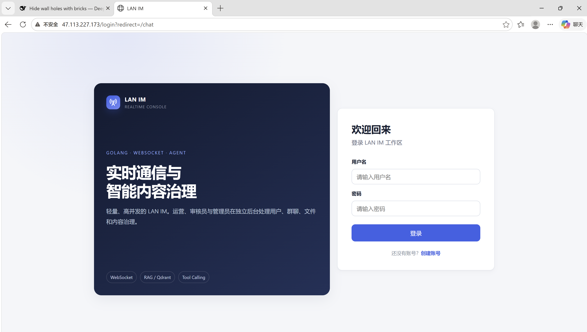

<details>
<summary>查看注册成功与聊天工作区截图</summary>

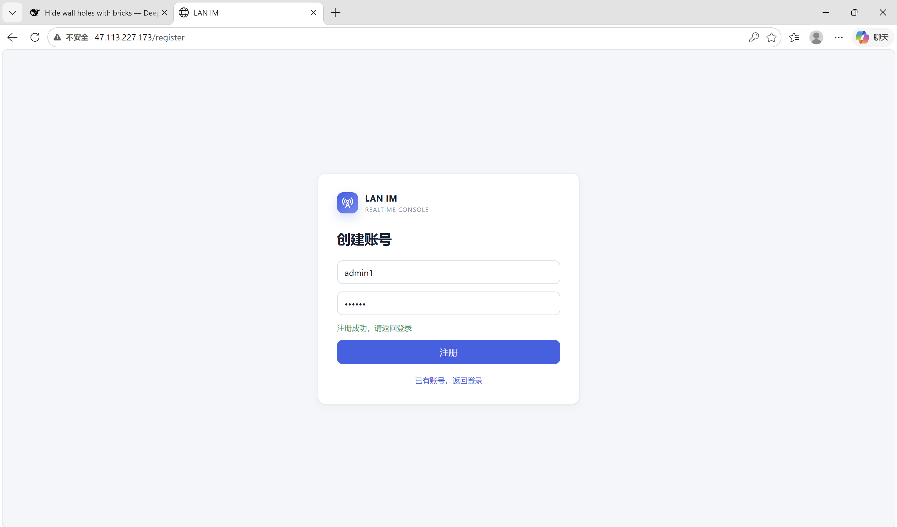

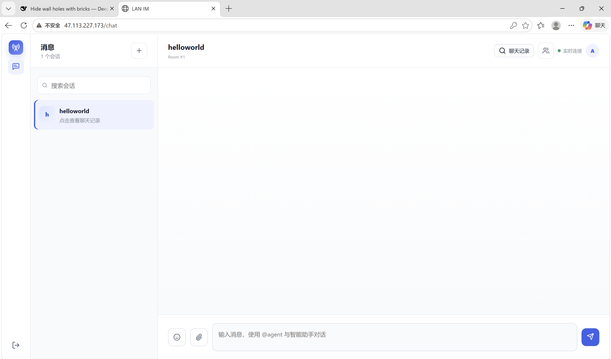

</details>

### 2. 双账号群聊与历史消息搜索

`admin1` 与 `admin2` 在 `helloworld` 房间内互发消息。左侧提供创建群聊、按群号加入及会话搜索入口，顶部显示实时连接状态。

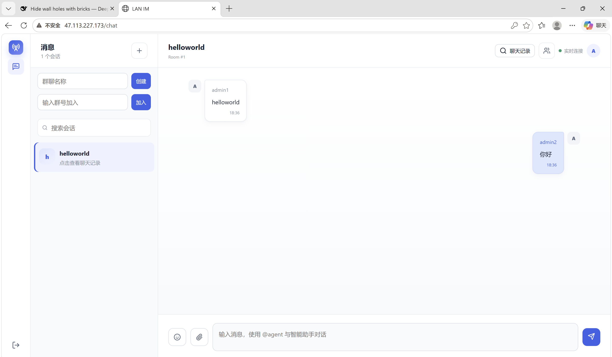

在聊天记录中搜索 `hell`，可以检索到此前发送的 `helloworld` 消息。

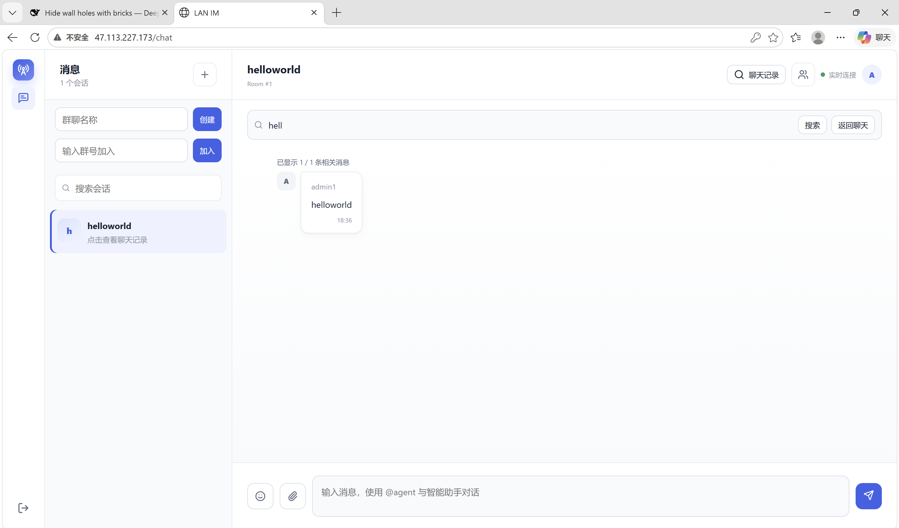

### 3. 文件上传与下载

通过附件入口选择本地文件，文件消息以链接形式展示在群聊中；点击 `使用说明.md` 后，浏览器下载列表显示已下载的文件。

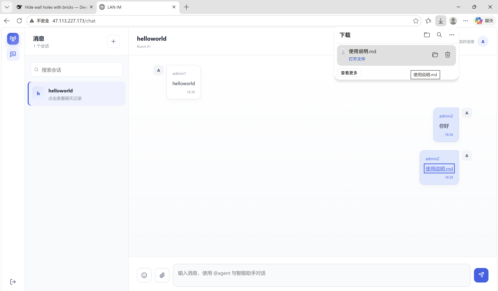

<details>
<summary>查看选择本地文件的操作截图</summary>

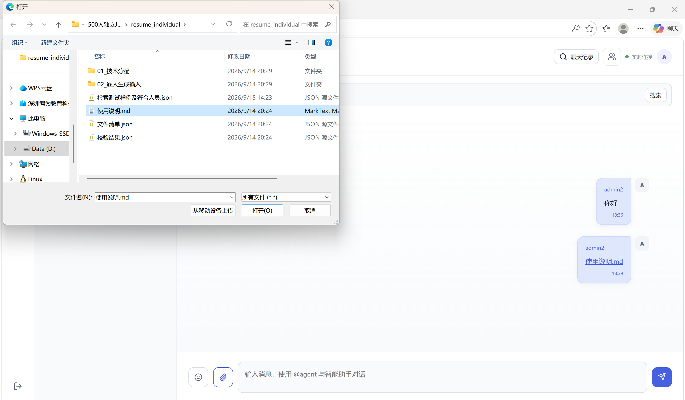

</details>

### 4. WebSocket 与 Gateway 监控

Grafana 看板展示 WebSocket 连接数、建连请求速率、建连可用率及各阶段延迟。截图时连接数面板显示 **10K**，建连可用率面板显示 **100%**；这些数值仅描述截图时的监控状态，不代表万连接同时发送消息的吞吐量或持续压测结论。

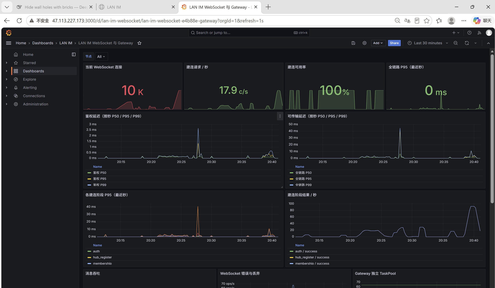

运行总览同时展示 Backend CPU、内存、WebSocket 活跃连接与 Kafka Consumer Lag 的变化，便于对照连接增长与资源使用情况。

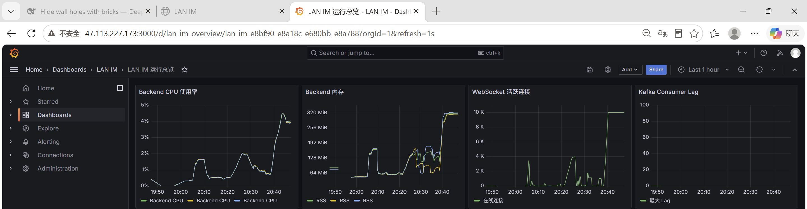

## 功能演示

以下截图展示用户端与管理端的实际界面（2026 年 9 月）。图片随仓库保存在 [`docs/screenshots`](docs/screenshots) 中，可直接在 GitHub README 中查看，点击图片可查看原图。

### 1. 群聊与文件分享

用户端以会话列表和消息时间线组织群聊，支持发送文字、表情和文件。截图中的 `helloworld` 房间展示了表情消息、文件下载链接和实时连接状态；顶部提供消息搜索与成员查看入口，输入框支持通过 `@agent` 与智能助手对话。

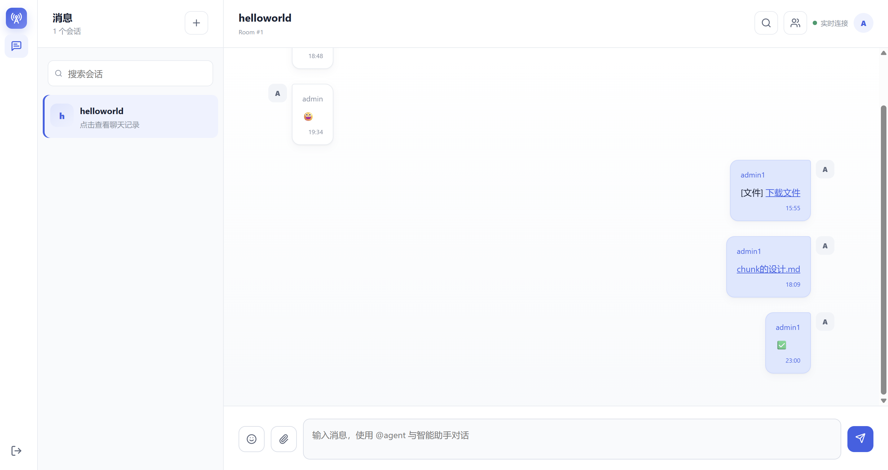

### 2. 用户登录

用户通过用户名和密码进入聊天工作区，也可以从登录页跳转到账号注册页面。登录后进入会话界面，选择房间进行交流。

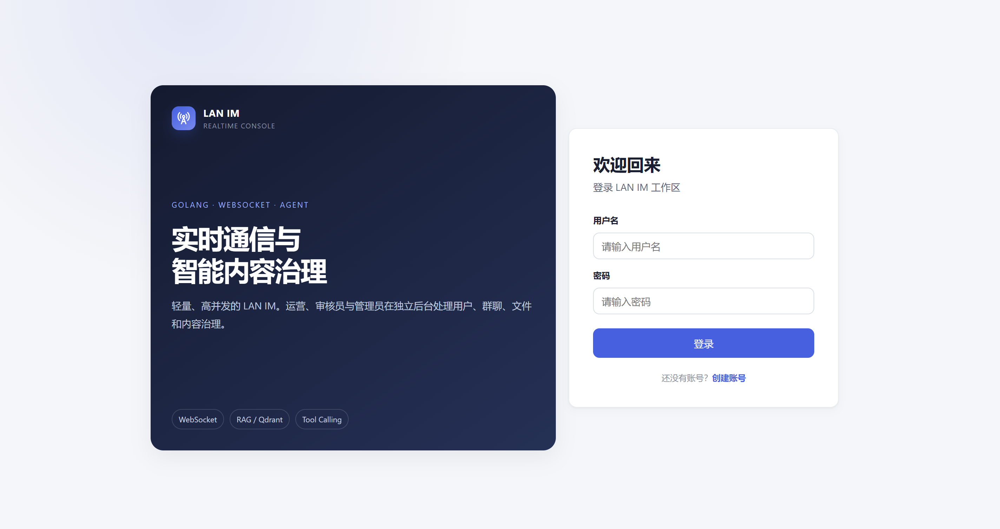

### 3. 独立管理端登录

管理后台使用独立的登录页面，由具备后台权限的账号进入。后台操作结合角色与接口权限校验，用于用户管理、群聊管理、内容治理、Agent 配置、文件审核和审计。

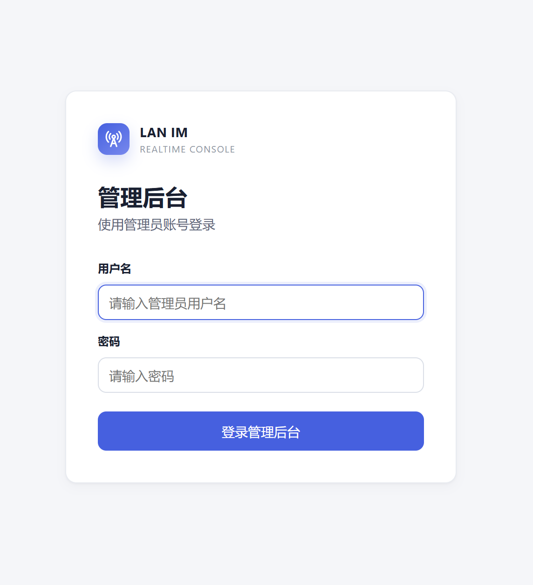

### 4. 用户封禁与权限管理

用户管理页集中展示账号角色、在线或封禁状态、群聊与消息数量、违规记录及最后活跃时间。管理员可以查看用户详情，并根据自身权限执行封禁、解封和后台角色调整；截图展示了普通用户与超级管理员的角色区分。

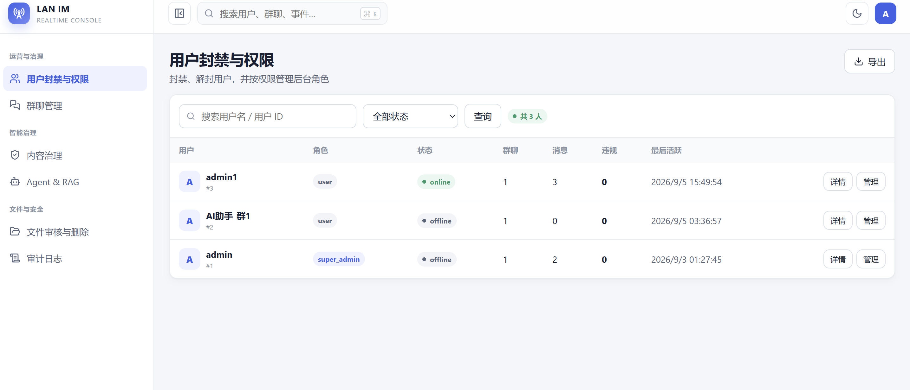

### 5. 群聊管理

群聊管理页展示群主、成员数、在线人数、今日消息、Agent 启用状态和违规数量，帮助管理员了解各房间的使用情况。通过详情与管理入口，可以查看成员并进行群聊治理；具备相应权限的管理员可以解散群聊。

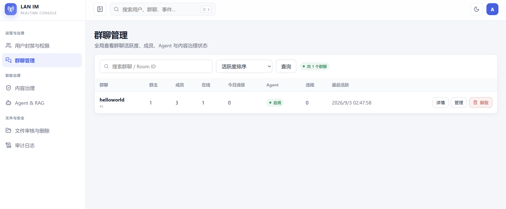

管理端页面由 `admin-frontend` 提供，默认 Docker 端口为 `5174`；业务接口由独立的 `admin-service` 提供，统一使用 `/api/v1/admin/*` 前缀。系统运行指标通过 Prometheus 与 Grafana 查看。部署方法见下文“服务器部署”，接口说明见 [API 文档](docs/API.md)。

## 当前架构概览

- 接入层：Nginx 提供 HTTP 与 WebSocket 反向代理；生产 HTTPS 建议由云负载均衡、Ingress 或独立 TLS 网关终止。
- 接入进程：Go `backend` 提供认证、WebSocket Hub、Agent 操作以及现有 IM/Admin 控制面 gRPC。
- 业务服务：`room-service` 独立处理房间；`message-service` 提供消息查询、搜索和文件 API；`message-sequencer` 单实例内存去重、分配群序号并独立消费正式消息广播；`message-worker` 异步归档。编号器暂不支持重启恢复，详见 [消息幂等推演与实现](docs/message-idempotency.md)。
- 管理服务：`admin-service` 独立提供管理 HTTP API，通过 gRPC 调用 Gateway 的运行时控制面。
- AI 层：Python `agent-service` 通过 FastAPI 提供管理接口，并由独立 Worker 消费 Kafka 执行审核、对话和分块。
- 存储层：MySQL/MongoDB 存业务与消息，Redis 做在线状态/缓存/Pub-Sub，Elasticsearch 做消息检索，Qdrant 做向量检索，MinIO/OSS 做对象存储。

### 容器通信图
nginx -> backend：HTTP REST + WebSocket，聊天前端入口；浏览器 WebSocket 消息载荷为 JSON。
nginx -> admin-service：`/api/v1/admin/*` 管理 API。
nginx -> room-service：房间和成员 HTTP API。
nginx -> message-service：消息历史、搜索和文件 HTTP API。
backend -> Kafka 待处理主题 -> message-sequencer -> Kafka 正式主题 -> message-worker / agent-worker：带固定 ID 和群序号的消息事件。
agent-worker -> backend：gRPC/protobuf，调用 IMService 查询消息、发送回复。
admin-service -> backend：gRPC 运行时管理。
backend -> MySQL：原生 MySQL 协议
backend -> Redis：原生 RESP；im:broadcast:* 消息载荷已使用 protobuf。
message-sequencer -> Redis -> backend：正式消息广播，携带固定 ID 和群序号。
backend -> Kafka：原生 Kafka 协议；聊天消息 Value 已使用 protobuf。
backend -> MongoDB：原生 Mongo/BSON 协议
message-service / message-worker -> Elasticsearch：HTTP JSON，ES 原生 API
message-service -> MinIO/OSS：对象存储 HTTP 协议
message-worker -> MySQL/MongoDB、Redis：消息持久化与缓存
agent-worker -> Qdrant：gRPC 向量读写
admin-service -> MySQL/Redis/MongoDB/MinIO：管理数据访问

旧部署升级须先停旧归档器，再启动独立 Worker，步骤见 [消息服务迁移说明](services/messages/README.md)。

## 压测基线

最新结果来自 `perf3b/` 与 `perf4/`，结论均以实测数据为准。
以下历史基线早于新增编号器，不代表当前两阶段 Kafka 链路的性能；新链路尚未重新压测。

### HTTP 只读接口（N+1 修复后，perf3b）

| 场景 | VU | RPS | P50 | P95 | P99 | 错误率 |
| --- | --- | --- | --- | --- | --- | --- |
| my_rooms/messages/members 慢爬坡 | 100 | 460.60 | 189.49ms | 421.95ms | 506.78ms | 0% |

### WebSocket（Hub 64 分片后，perf4）

建连爬坡：

| 目标 VU | 服务端峰值在线 | 建连 P50 | 建连 P95 | 建连最大 |
| --- | --- | --- | --- | --- |
| 100 | 100 | 80.72ms | 88.12ms | 113.03ms |
| 500 | 500 | 80.33ms | 88.46ms | 105.99ms |
| 1000 | 938 | 80.64ms | 1.04s | 21.06s |

群聊广播：

| 房间规模 | 服务端峰值在线 | E2E 平均 | E2E P95 | 备注 |
| --- | --- | --- | --- | --- |
| 500 人 | 500 | 70.15ms | 99ms | Kafka lag 0，任务池等待 0 |
| 1000 人 | 949 | 54.60ms | 71ms | 任务池运行峰值 256，等待 0 |

说明：压测使用预生成 JWT，避免登录 bcrypt 占满 CPU；完整数据见 `perf3b/HTTP慢爬坡报告.md`、`perf4/WebSocket分片压测报告.md`、`perf4/WebSocket分片压测分析.md`。

## 服务器部署

本文档以单台 Ubuntu 22.04 / 24.04 云服务器为例。项目已提供 `docker-compose.yml`，部署时只需要准备服务器环境、修改 `.env`、构建前端、启动容器。

### 1. 环境要求

- Docker Engine 20+ 与 Docker Compose v2
- Node.js 20+（仅用于构建前端 `dist`）
- Git
- 推荐配置：最低 `4C8G`，压测建议 `8C16G`

安装 Docker：

```bash
curl -fsSL https://get.docker.com | sudo sh
sudo systemctl enable --now docker
```

安装 Node.js：

```bash
curl -fsSL https://deb.nodesource.com/setup_20.x | sudo -E bash -
sudo apt-get install -y nodejs
```

### 2. 拉取项目

```bash
mkdir -p ~/apps
cd ~/apps
git clone <你的仓库地址> lan-im
cd lan-im
```

### 3. 配置环境变量

```bash
cp .env.example .env
sed -i 's/\r$//' .env
vim .env
```

重点修改以下变量：

| 变量 | 说明 |
| --- | --- |
| `DB_PASSWORD` | MySQL root 密码，必须改成强密码 |
| `JWT_SECRET` | JWT 签名密钥，建议使用随机长字符串 |
| `ADMIN_CONTROL_TOKEN` | 管理端控制面 Token，必须修改 |
| `MINIO_ACCESS_KEY` | MinIO 访问账号 |
| `MINIO_SECRET_KEY` | MinIO 访问密钥，必须修改 |
| `MINIO_PUBLIC_ENDPOINT` | 浏览器可访问的 MinIO 地址，例如 `http://你的公网IP:9000` |
| `LLM_BASE_URL` / `LLM_API_KEY` / `LLM_MODEL` | LLM 对话模型配置 |
| `EMBED_BASE_URL` / `EMBED_API_KEY` / `EMBED_MODEL` | Embedding 模型配置 |
| `MESSAGE_STORE` | 消息存储后端，`mysql` 或 `mongo` |
| `MONGO_URI` | MongoDB 地址，仅 `MESSAGE_STORE=mongo` 时使用 |
| `ES_ADDR` | Elasticsearch 地址 |
| `NODE_ID` | 当前节点标识，单机可保持默认值 |
| `STORAGE_BACKEND` | 对象存储类型，`minio` 或 `oss` |
| `AGENT_HTTP_PORT` | Python Agent 服务 FastAPI 端口，默认 `8000` |
| `NGINX_SERVER_NAME` | Nginx 接收的域名，本地/局域网可使用 `_` |
| `NGINX_BACKEND_HOST` | Nginx 上游服务名，Docker Compose 默认使用 `backend` |
| `NGINX_BACKEND_PORT` | Nginx 上游端口，默认 `8080` |

注意：`MINIO_PUBLIC_ENDPOINT` 不能填 `localhost` 或 `127.0.0.1`，否则用户浏览器无法直接上传文件。

### 4. 构建前端

`docker-compose.yml` 中 Nginx 直接挂载宿主机 `frontend/dist`，因此启动前必须先构建前端。

```bash
cd frontend
npm ci
npm run build
cd ..
```

### 5. 启动服务

```bash
docker compose config --quiet
docker compose up -d --build
docker compose ps
docker compose exec nginx nginx -t
```

查看日志：

```bash
docker compose logs -f backend
docker compose logs -f nginx
docker compose logs -f agent-service
```

### 6. Prometheus / Grafana 监控

Docker Compose 已包含 Prometheus 和 Grafana。启动完整服务时会一并启动，也可以单独启动监控组件：

```bash
docker compose up -d prometheus grafana
docker compose ps prometheus grafana
```

本机监控入口：

| 入口 | 地址 | 说明 |
| --- | --- | --- |
| Backend Metrics | `http://127.0.0.1:6060/metrics` | Go 服务原始指标，包含 CPU、内存、WebSocket、Hub、Kafka、Redis 和数据库指标 |
| Admin Metrics | `http://127.0.0.1:8081/metrics` | 独立管理服务的 API 延迟、完成 QPS 和运行指标 |
| Room Metrics | `http://127.0.0.1:8082/metrics` | 独立房间服务的 API 延迟、完成 QPS 和运行指标 |
| Agent Metrics | `http://127.0.0.1:8000/metrics` | Python Agent API 指标；Worker 指标由 Prometheus 在容器网络内采集 |
| Go pprof | `http://127.0.0.1:6060/debug/pprof/` | Go CPU、堆、goroutine 等性能诊断入口 |
| Prometheus | `http://127.0.0.1:9090` | PromQL 查询和历史时序数据 |
| Prometheus Targets | `http://127.0.0.1:9090/targets` | 检查 Backend、Agent API 和 Agent Worker 抓取目标是否为 `UP` |
| Grafana | `http://127.0.0.1:3000` | 预置监控看板 |

Prometheus 每秒采集 Backend、Admin、Room、Agent API 和 Agent Worker 指标，默认保留 15 天。Grafana 已自动配置 Prometheus 数据源。登录 Grafana 后可使用四个预置看板：

```text
Dashboards -> LAN IM -> LAN IM 运行总览
Dashboards -> LAN IM -> LAN IM WebSocket 与 Gateway
Dashboards -> LAN IM -> LAN IM Agent 与 RAG
Dashboards -> LAN IM -> LAN IM Gateway 压测
```

WebSocket 看板包含鉴权到可传输的全链路阶段、按秒 P50/P95/P99、连接、消息、错误和独立 TaskPool；Agent 看板包含审核、分块、Embedding、Qdrant、对话与移除申请。默认 Grafana 用户名和密码均为 `admin`，部署前应通过 `.env` 修改：

```env
GRAFANA_ADMIN_USER=admin
GRAFANA_ADMIN_PASSWORD=请替换为强密码
GRAFANA_PORT=3000
PROMETHEUS_PORT=9090
PROMETHEUS_RETENTION=15d
```

常用 PromQL：

```promql
# Backend 单核 CPU 使用百分比
rate(process_cpu_seconds_total{job="lan-im-backend"}[1m]) * 100

# Backend RSS 物理内存（MiB）
process_resident_memory_bytes{job="lan-im-backend"} / 1024 / 1024

# 当前 WebSocket 在线连接
sum(im_ws_connections_active)

# Kafka 最大消费积压
max(im_kafka_consumer_lag)
```

云服务器不应将 `3000`、`6060`、`9090` 直接暴露到公网。可通过安全组限制为办公 IP，或使用 SSH 隧道访问：

```bash
ssh -L 3000:127.0.0.1:3000 -L 9090:127.0.0.1:9090 user@服务器地址
```

完整接口联调说明见 `docs/API.md`，更完整的指标说明见 `docs/metrics.md`。

### 7. 创建账号并设置超管

先访问 `http://你的公网IP/register` 注册一个普通账号，然后进入 MySQL 提升为超级管理员：

```bash
docker compose exec db mysql -uroot -p lan_im
```

```sql
UPDATE users SET role = 1 WHERE username = '你的用户名';
```

重新登录后访问 `http://你的公网IP/admin/users` 即可进入治理后台。运行监控统一从 Grafana 查看。

### 8. 云服务器安全组

公网建议只开放：

- `80`：HTTP 入口
- `9000`：MinIO 文件直传，仅在使用预签名 URL 直传时需要

如果由云负载均衡或独立 TLS 网关终止 HTTPS，再按其部署方式开放 `443`；当前 Compose 中的 Nginx 默认只监听 `80`。

以下端口不要对公网开放：

```text
3000 3306 6379 8000 9090 9092 9200 27017 6333 6334 8080 6060 50052 50053 9001
```

MinIO 控制台 `9001` 建议只允许办公 IP 或通过 SSH 隧道访问。

### 9. HTTPS 说明

当前 Nginx 默认只启用 HTTP，并通过启动模板读取 `.env` 中的域名和上游地址，不在镜像中生成或保存固定自签证书。生产环境建议由云负载均衡、Ingress 或独立 TLS 配置终止 HTTPS：

1. 将域名解析到服务器公网 IP。
2. 使用 Certbot 申请证书。
3. 将证书保存在专用密钥服务或只读挂载目录中，不要构建进镜像。
4. 将 HTTPS 请求反向代理到本项目 Nginx 的 HTTP 入口。

### 9.1 高并发 WebSocket 接入参数

Nginx 已配置 `worker_connections 65535`、`worker_rlimit_nofile 65535` 和 `listen ... backlog=65535`。这些参数需要同时满足宿主机和容器限制；仅修改 `worker_connections` 不代表系统一定能接收同样数量的连接。

在 Linux 云服务器上部署前，建议确认并持久化监听队列上限：

```bash
sysctl net.core.somaxconn
sudo sysctl -w net.core.somaxconn=65535
echo 'net.core.somaxconn=65535' | sudo tee /etc/sysctl.d/99-lan-im.conf
sudo sysctl --system
```

检查实际生效值：

```bash
docker compose exec nginx nginx -T | grep -E 'worker_rlimit_nofile|worker_connections|listen .*backlog'
docker compose exec nginx sh -c 'ulimit -n; cat /proc/1/limits | grep -i "open files"'
docker inspect im-nginx --format '{{json .HostConfig.Ulimits}}'
```

如果压测仍在约 900～1000 连接处出现 20 秒级失败，应分别执行“直连 backend:8080”和“经 Nginx:80”的 A/B 测试，并检查云安全组、宿主机 `somaxconn`、SYN backlog 和 NAT/连接跟踪限制。`perf6` 中后端 CPU、DB、Redis、Kafka 和进程 fd 均未达到瓶颈，因此不能把该现象归因于 Go 接口或 Hub 任务池。

### 10. 升级部署

```bash
cd ~/apps/lan-im
git pull

cd frontend
npm ci
npm run build
cd ..

docker compose up -d --build
```

### 11. 数据备份

主要数据保存在 Docker named volume 中，可先查看：

```bash
docker volume ls
```

建议定期备份 MySQL、MongoDB、MinIO、Qdrant、Elasticsearch 对应的数据卷，并保存 `.env` 文件。
