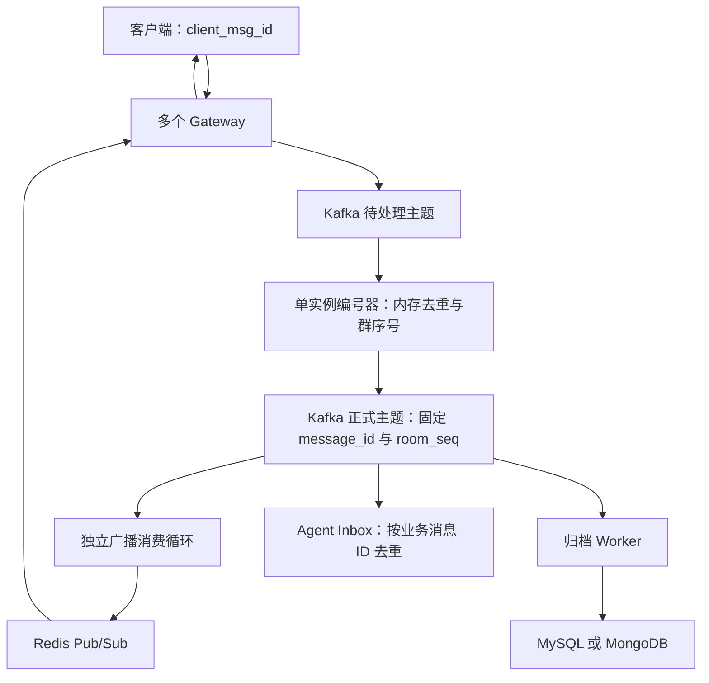

# 消息幂等与群序号：推演记录和当前实现

本文件整理消息去重、顺序、可靠投递的讨论，并区分已实现机制与后续设计。当前版本采用「单实例内存编号器 + 至少一次投递 + 下游幂等」，按项目当前范围暂不实现编号器崩溃恢复。

## 1. 问题从哪里来

原链路是 Gateway 接收 `client_msg_id`，写入 Kafka 后直接向 Redis 广播，归档 Worker 异步消费并在落库时生成消息 ID。数据库通过客户端凭证唯一索引去重；Agent Inbox 用 Kafka topic、partition、offset 去重同一记录的重放。

这并不等于全链路幂等：

- Gateway 仅检查客户端凭证，不负责业务去重；重发可能形成多条不同 offset 的 Kafka 记录。
- 不同 offset 的重复业务消息可能触发多个 Agent Inbox。
- 广播和历史缺少共同的正式消息编号，前端可能出现重复气泡。
- 如果群序号在归档时分配，「你好」先广播但归档失败，「我很好」随后广播却先落库，序号可能与对话因果顺序相反。

结论：编号应在广播前确定，归档只能保存原编号，不能根据落库完成时间重新编号。

## 2. 各种 ID 分别解决什么

| 字段 | 分配方 | 用途 |
| --- | --- | --- |
| `client_msg_id` | 客户端 | 标识一次发送意图，重试复用 |
| `(sender_id, client_msg_id)` | 编号器作为联合键使用 | 不同用户的凭证互不冲突 |
| `message_id` | 编号器 | 正式消息身份，重投不变 |
| `room_seq` | 编号器 | 群内序号，展示和历史分页 |
| `trace_id` | 链路追踪系统 | 排错，不作为业务去重键 |
| Kafka partition、offset | Kafka | 日志位置和消费进度，不是业务消息身份 |

这些字段独立保存，不拼接成超长消息 ID，也不截断雪花 ID。内部使用 64 位整数，向浏览器输出 ID、群序号时使用十进制字符串，避免 JavaScript Number 精度丢失。当前编号器使用单进程时间序列 ID，不宣称它是支持多节点的完整雪花实现。

`trace_id` 不能替代业务幂等键：同一次发送重试可能进入新的 trace，同一个 trace 也可能包含多个合法业务操作。Kafka offset 同样不能识别生产者在不同日志位置写入的同一业务消息。

## 3. 用户发送队列为什么不能消除所有重复

「每用户一个待发送队列，确认后移除队头、更新最后成功位置」能控制发送推进，但仍存在确认丢失窗口：Kafka 已写入，发送方没收到确认，或者收到确认后尚未更新队列就退出。重试可能再次写入。

最后成功 ID 应赋值为成功消息的 ID，不能对雪花 ID 简单加一。雪花 ID 也不保证多 Gateway 的网络到达顺序；串行处理和统一排序入口才确定群内接受顺序。

可以允许重复传输，要求重复不产生第二份业务效果。幂等与不丢消息是两个目标：还需要可靠确认、重试、消息保留和补拉。

## 4. 比较过的方案

### 4.1 MongoDB 先保存再广播

每群一个计数器文档，`findOneAndUpdate` 配合 `$inc` 原子递增。若计数器、消息、Outbox 在一个事务里提交，可以在广播前确定可靠的消息和序号，但数据库写入进入发送关键路径。MongoDB 多文档事务需要副本集或分片集群。

### 4.2 Kafka 事务流处理

将正式消息、去重与群计数器的状态日志、输入消费进度放在同一个 Kafka 事务中，下游使用 `read_committed`。这需要正确的状态恢复、回滚、分区接管，不能仅增加内存 Map，也不能用 Kafka 事务覆盖普通 Redis 或 MongoDB 写入。

### 4.3 固定编号，允许正式消息重复投递

重复输入返回原来的消息 ID、群序号和内容。发送失败或结果不确定时重发相同正式消息；下游幂等。因此 Kafka 事务不是唯一选择。

完整可靠版本仍需保存编号状态，不能在发现「已经编号」后直接跳过未确认的输出。消息可能已编号但尚未进入 Kafka。

方案之间没有未经验证的速度结论。同步状态存储、Kafka 事务批量大小、确认级别、同群竞争都会影响延迟和吞吐，需要相同可靠性条件下压测。

## 5. 串行与原子保存的区别

串行解决并发修改，原子保存解决两次写入之间退出。每次分配涉及「群计数器」和「请求到编号的映射」：

- 先保存计数器，映射保存前退出，可能留下空号。
- 先保存映射，计数器保存前退出，下一条可能重复使用同一序号。
- 要避免失败分配造成空号，可以一起原子保存。
- 若接受空号，可以先可靠递增，再可靠保存映射，两步成功后才输出，但必须处理单写者、写入结果不确定和存储回退。

仅从正式 Kafka 的最后一条消息恢复最大序号不够：还缺少客户端凭证到原编号的映射，也无法恢复已分配却尚未输出的状态。

本版按需求明确排除编号器退出后的恢复，所以以上是后续可靠版本的设计依据，并未伪装成已经实现。

## 6. 当前实际链路



编号和广播循环部署在新增的 `message-sequencer` 容器中，两个循环独立执行。归档仍在 `message-worker` 容器，历史查询在 `message-service`。Redis 广播失败只阻塞广播循环，不等待数据库，也不重新编号。

### 接收与编号

1. Gateway 将认证用户 ID 与客户端消息写入待处理主题，同步等待 Kafka `RequireAll` 确认；不再直接广播。当前 WebSocket 没有新增独立的「接收成功」ACK 协议，不应宣称实现了送达回执。
2. 编号器顺序消费输入。新凭证生成消息 ID，该群序号从 1 递增；重复凭证返回第一次接受的完整消息。
3. 相同凭证携带不同内容、类型或房间时拒绝，记录日志且不消耗序号。当前尚未提供异步冲突错误回传给客户端。
4. 向正式主题发送相同编号的消息，失败重试，成功后提交输入 offset。重复客户端输入也可能再次输出相同正式消息，由下游幂等。
5. 正式主题的广播循环只接受已编号消息，并在 Redis 发布成功后提交自己的消费进度。

### 归档和缓存

- 归档禁止自行生成 ID，也拒绝缺少正式 ID 或群序号的消息。
- MySQL、MongoDB 使用发送者与客户端凭证联合唯一约束，另外使用消息主键和群序号唯一约束。
- MySQL 旧消息序号为 NULL，MongoDB 对正序号建立部分唯一索引，不强行给历史消息回填序号。
- 新正式消息的 ID、群序号、发送者、内容若与已有结果冲突则报错，不能把冲突静默当成成功。
- 数据库写入失败不推进归档游标；重放保留原记录。当前归档器失败会退出，由容器策略重新拉起。
- 历史分页优先按群序号，未编号历史排在新消息之前。游标仍使用消息 ID 来定位记录，兼容现有 API。
- Redis 最近消息改用 v2 有序集合，按群序号排序；归档旧消息的重放不会将它顶到最新位置。缓存仍是归档后填充，不是可靠消息日志。
- Elasticsearch 以消息 ID 作为文档身份；旧索引的历史文档需要单独重建才能统一旧身份规则。

### Agent 和前端

- Agent Inbox 使用 `message:<message_id>`，不同 Kafka offset 的同一正式消息只产生一个 Inbox。后续外部工具调用的副作用仍需各自的幂等机制。
- 前端按消息 ID／群内序号／发送者作用域凭证合并历史和实时消息，按群序号排列。
- 不使用「序号小于最大已见值就丢弃」策略，晚到的新消息仍会插入正确位置。
- 历史请求期间收到的实时消息会被合并，避免请求完成后覆盖已经显示的新消息。

## 7. 本版边界

1. 编号器仅一个实例，输入和正式主题均限定单分区。已有归档器固定读分区 0，因此启动检查不允许误接多分区主题。多个 Gateway 可以同时接入，但不支持编号器扩容或热接管。
2. 去重映射与群计数器仅存在内存，暂不清理，内存会随唯一消息数量增长。
3. 编号器进程退出、手动重启、容器重建后，原映射和计数器丢失；新编号可能与已有群序号冲突。Compose 不自动重启编号器。**不能通过简单重启承诺继续原群的正确编号。**
4. 没有 Kafka 事务、编号状态日志、恢复检查点或完整 Outbox。
5. Kafka 为现有开发环境的单副本部署，`RequireAll` 不等于多副本容灾；长期积压仍受磁盘和保留期限约束。
6. Redis Pub/Sub 不是离线消息队列，发布成功不等于客户端已收到。可靠断线补拉、近期未归档消息补齐和送达回执尚未实现。
7. Agent 的外部 API 调用、搜索索引失败后的补偿不在本次完整幂等保证之内。
8. 没有新增性能压测结果，不能宣称本版比 Kafka 事务更快。

## 8. 配置与首次切换

默认新主题：

```dotenv
KAFKA_INGRESS_TOPIC=im_chat_messages_ingress_v1
KAFKA_TOPIC=im_chat_messages_sequenced_v1
```

旧 `.env` 中 `KAFKA_TOPIC=im_chat_messages` 会覆盖默认值，首次切换应明确改为新的空正式主题，不能把未编号旧消息混入正式主题。Gateway、编号器、归档器、Agent 必须使用一致配置。旧数据库历史不删除。

首次切换应暂停旧链路写入、排空旧归档积压，再更新数据库字段和索引、构建所有受影响进程，启动编号器和新链路。不要让旧生产者、旧归档器与新链路混跑。

新 Compose 服务的构建入口为 `services/messages/cmd/sequencer`，镜像沿用 `services/messages/Dockerfile` 的 `MESSAGE_PROCESS=sequencer`。编号器在 6062 提供健康检查和指标。

当前改造不自动切换已有业务容器，先通过隔离环境验证。未来若要在原群持续运行并支持重启，应先补齐编号状态持久化。

## 9. 验证方式

- Go 单元测试覆盖同群顺序、跨群独立、不同用户相同凭证、并发重复请求、内容冲突、Kafka 确认丢失后原编号重投和广播重试。
- 协议测试覆盖超过 JavaScript 安全整数范围的消息 ID；前端测试覆盖晚到消息、重复广播、历史合并和大整数排序。
- 隔离链路测试先完成 Kafka 编号和 Redis 广播，再启动归档，验证数据库不阻塞实时路径；同时检查 MySQL、MongoDB 去重、冲突拒绝和群序号分页。
- Python 测试验证 Agent Inbox 幂等键不随 Kafka offset 变化。
- 不把编号器重启恢复列为已通过的能力，因为本版明确没有实现。

2026-09-08 隔离实测：输入包含客户端重发，并模拟正式 Kafka 写入成功但确认丢失；5 条正式 Kafka 记录在 MySQL、MongoDB 中均落为 3 条业务消息，群序号为 1、2、3。Redis 广播完成后才启动归档，验证实时链路不依赖数据库落库。两个存储的重放、冲突拒绝和序号分页检查通过。

完整隔离 HTTP/WebSocket 冒烟也已通过：独立 Gateway、编号器、Room、Message API、归档和 Nginx 完成登录、建群、重复发送、历史、搜索、文件凭证及鉴权检查，并验证每条广播和历史记录的 ID、群序号完全一致。Node 前端测试 3 项、Python Agent 测试 3 项、Go 全量测试和静态检查通过。未进行编号器崩溃恢复验证或性能压测。

## 10. 秋招如何表述

可以介绍已经实现的「广播前统一编号、重复投递保持身份、数据库与前端幂等、Agent Inbox 去重」，并展示测试。编号器状态恢复、分区接管、事务方案应明确说是后续设计，不能说已经做到生产级全链路恰好一次。

参考：[Kafka 事务和投递语义](https://kafka.apache.org/41/design/design/)、[MongoDB 原子性](https://www.mongodb.com/docs/manual/core/write-operations-atomicity/)、[OpenTelemetry 追踪概念](https://opentelemetry.io/docs/specs/otel/overview/)。
